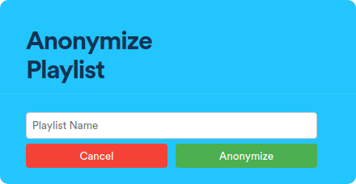

# PlaylistProxy

A spicetify extension for [playlistproxy.net](https://playlistproxy.net/)

Spotify has no official way to share your favorite playlist without revealing your (online) identity. This spicetify plugin utilizes playlistproxy.net to create an anonymous dupe of your playlist of choice to share with online strangers.

<p>
  
</p>

## Installing
Use the [Marketplace](https://github.com/spicetify/spicetify-marketplace/wiki/Installation) to install it or install it manually like so:

Copy the `PlaylistProxy.js` file into your [Spicetify](https://github.com/spicetify/spicetify-cli) extensions directory:
| **Platform** | **Path**                                                                            |
|------------|-----------------------------------------------------------------------------------|
| **Linux**      | `~/.config/spicetify/Extensions` or `$XDG_CONFIG_HOME/.config/spicetify/Extensions/` |
| **MacOS**      | `~/spicetify_data/Extensions` or `$SPICETIFY_CONFIG/Extensions`                      |
| **Windows**    | `%appdata%\spicetify\Extensions\`                                              |

Then run the following commands:

```
spicetify config extensions PlaylistProxy.js
spicetify apply
```